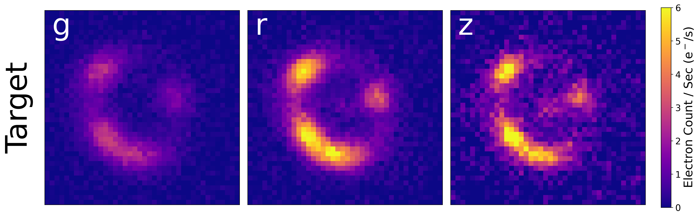

# Domain Adaptation and Uncertainty Quantification for Gravitational Lens Modeling


<p align="justify"> 
This project combines Domain Adaptation (DA) with neural network Uncertainty Quantification (UQ) in the context of strong gravitational lens parameter prediction. We hope that this work helps take a step towards more accurate applications of deep learning models to real observed datasets, especially when the latter have limited labels. We predict the Einstein radius $\theta_\mathrm{E}$ from simulated multi-band images of strong gravitational lenses. Generally, to our knowledge, this is the first work in which domain adaptation and uncertainty quantification are combined, including for regression on an astrophysics dataset.
</p>

&nbsp;
&nbsp;

## UQ: Mean-variance Estimation (MVE)

<p align="justify"> 
For UQ, we use a mean-variance estimation (MVE) NN to predict the Einstein radius $\theta_\mathrm{E}$ and its aleatoric uncertainty $\sigma_\mathrm{al}$. Scientific analysis requires an estimate of uncertainty on measurements. We adopt an approach known as mean-variance estimation, which seeks to estimate the variance and control regression by minimizing the beta negative log-likelihood loss.
</p>

&nbsp;


## Unsupervised Domain Adaptation (UDA)

<p align="justify">
Applying deep learning in science contexts like astronomy presents multiple challenges. For example, when models trained on simulated data are applied to real data, they tend to underperform because simulations rarely adequately capture the complexity of real data. Enter domain adaptation (DA), a framework for 
</p>

<p align="justify"> 
In this work, we use unsupervised DA (UDA), where the target data The DA technique used in this work, we use the Maximum Mean Discrepancy (MMD) Loss to train a network to being embeddings of labeled source gravitational lenses in line with unlabeled "target" gravitational lenses. With source and target datasets made similar, training on source datasets can be used with greater fidelity on target datasets. Unsupervised DA aligns an unlabelled "target" dataset with a labeled "source" dataset so that predictions can be performed on both with accuracy. That target domain has a domain shift that must be aligned. In our case, we add realistic astrophysical survey-like noise to strong lensing images in the target dataset but no noise in the source dataset. 
</p>
&nbsp;


&nbsp;


## Datasets

<p align="justify">
  
We generate strong lensing images for training and testing with `deeplenstronomy`. In the figure below, we show a single simulated strong lens in three bands ($g$, $r$, $z$) without noise (source domain; upper panel) and with DES-like noise (target domain; lower panel). The datasets (images and labels) can be downloaded from the project's zenodo site: [zenodo: Neural network prediction of strong lensing systems with domain adaptation and uncertainty quantification
](https://zenodo.org/records/13647416).

&nbsp;



 
</p>

&nbsp;


## Installation 

Clone the package into any directory:
> git clone https://github.com/deepskies/DomainAdaptiveMVEforLensModeling

Create environments with `conda` for training and for simulation, respectively:

> conda env create -f training_env.yml.

> conda env create -f deeplenstronomy_env.yml


<p align="justify">
  
A `yaml` file (i.e., `training_env.yml`) is required for training the `pytorch` neural network model, and `deeplenstronomy_env.yml` is required for simulating strong lensing datasets with `deeplenstronomy`. There is a sky brightness-related bug in the PyPI 0.0.2.3 version of `deeplenstronomy`, and an update to the latest version will be required for reproduction of results. This works on Linux but has not been tested for Mac or Windows.
</p>

&nbsp;


## Reproducing the Paper Results

### Acquiring the Dataset

* __Option A: Generate the Dataset__
    * Navigate to `src/sim/notebooks/`.
    * Generate a source/target data pair in the `src/data/` directory by running `gen_sim.py` on the yaml files (`src/sim/config/source_config.yaml` and `src/sim/config/target_config.yaml` for source and target, respectively):
        * > gen_sim.py src/sim/config/source_config.yaml src/sim/config/target_config.yaml
  
* __Option B: Download the Dataset__
    * Zip files of the dataset are available through (zenodo)[https://zenodo.org/records/13647416].
    * The source and target data downloaded should be added to the `src/data/` directory.
        * Move or copy the directories `mb_paper_source_final` and `mb_paper_target_final` into the `src/data/` directory.

&nbsp;

### Training the Model

* __MVE-Only__
    * Navigate to `src/training/MVEonly/MVE_noDA_RunA.ipynb` (or Run B, C, D, E)
    * Activate the conda environment that is related training:
    * Use the notebook `src/sim/notebooks/training.ipynb`.
    * Trained model parameters will be stored in the `models/` directory.
    
* __MVE-UDA__
    * Follow an identical procedure to the above, replacing `src/training/MVEonly/` with `src/training/MVEUDA/`.

&nbsp;

### Visualizing the Paper Results

* To generate the results in the paper, use the notebook `src/training/MVEUDA/ModelVizPaper.ipynb`.
    * Final figures from this notebook are stored in `src/training/MVEUDA/figures/`. 
    * Saved PyTorch models of the runs are provided in `src/training/MVE*/paper_models/`.

  
<div style="display: flex; justify-content: space-between;">
  
  
</div>

&nbsp;

## Repository File Structure

```
DomainAdaptiveMVEforLensModeling/
│
├── src/
│   ├── sim/
│   │   ├── configs/
│   │   │   └── deeplenstronomy config files to generate the data
│   │   │
│   │   └── notebooks/
│   │       └── gen_sim.ipynb: used to generate the data in data/.
│   │   
│   │
│   ├── data/
│   │   └── Data should be stored here after download or generation.
│   │
│   └── training/
│       ├── MVEonly/
│       │   ├── paper_models/
│       │   │   └── Final PyTorch models in the MVEonly model + training information.
│       │   │
│       │   └── RunA.ipynb
│       │       └── Notebook(s) with different seeds required to run the MVEonly model.
│       │
│       └── MVEUDA/
│           ├── paper_models/
│           │   └── Final PyTorch models in the MVEonly model + training information.
│           │
│           ├── figures/
│           │   └── All figures in the paper are drawn from here.
│           | 
│           ├── RunA.ipynb
│           │   └── Notebook(s) with different seeds required to run the MVE-UDA model.
│           │
│           └── ModelVizPaper.ipynb
│               └── Notebook used to generate figures in figures/ from data in paper_models/.
│
└── envs/
    └── Conda environment specification files.

[ASCII formatting generated using ChatGPT]
```

&nbsp;


## Citation 

#### This code was produce by [Shrihan Agarwal](https://github.com/ShrihanSolo)

```tex
@article{key , 
    author = {Shrihan Agarwal, Aleksandra Ciprijanovic, Brian Nord}, 
    title = {Domain-adaptive neural network prediction with
    uncertainty quantification for strong gravitational lens
    analysis}, 
    journal = {Accepted to the Machine Learning for the Physical Sciences workshop at Neurips 2024}, 
    year = {2024}
}
```

&nbsp;

### Acknowledgement 
This project is a part of the [DeepSkiesLab](https://deepskieslab.com). We greatly appreciate advice and contributions from Jason Poh, Paxson Swierc, Megan Zhao, and Becky Nevin; this work would be impossible without building on their earlier discoveries. We used the [Fermilab Elastic Analysis Facility (EAF)](https://eafjupyter.readthedocs.io/) for computational and storage purposes in this project. This project  used data from both the Dark Energy Survey and Dark Energy CAM Legacy Survey DR10 to generate realistic data; we thank the collaborations for making their catalogs accessible.
