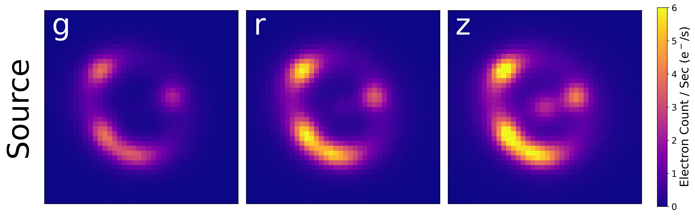
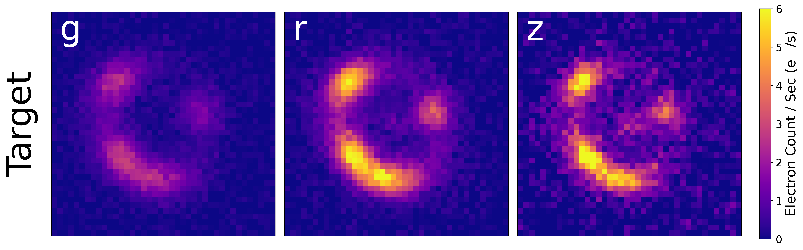

## Domain Adaptation and Uncertainty Quantification for Gravitational Lens Modeling


#### By: Shrihan Agarwal

This project combines the emerging field of Domain Adaptation with Uncertainty Quantification, working towards applying machine learning to real scientific datasets with limited labelled data. For this project, simulated images of strong gravitational lenses are used as source and target dataset, and the Einstein radius $\theta_E$ and its aleatoric uncertainty $\sigma_\textrm{al}$ are determined through regression. 

Applying machine learning in science domains such as astronomy is difficult. With models trained on simulated data being applied to real data, models frequently underperform - simulations cannot perfectlty capture the true complexity of real data. Enter domain adaptation (DA). The DA techniques used in this work use Maximum Mean Discrepancy (MMD) Loss to train a network to being embeddings of labelled "source" data gravitational lenses in line with unlabeled "target" gravitational lenses. With source and target datasets made similar, training on source datasets can be used with greater fidelity on target datasets.

Scientific analysis requires an estimate of uncertainty on measurements. We adopt an approach known as mean-variance estimation, which seeks to estimate the variance and control regression by minimizing the beta negative log-likelihood loss. To our knowledge, this is the first time that domain adaptation and uncertainty quantification are being combined, especially for regression on an astrophysical dataset.

### Datasets

Domain Adaptation aligns an unlabelled "target" dataset with a labelled "source" dataset, so that predictions can be performed on both with accuracy. For this project, both source and target datasets are generated using ```deeplenstronomy```. Below we show a single 3-band image simulated using the source and target datasets, as a comparison.





The datasets with these images, as well as the training labels, can be downloaded from zenodo: https://zenodo.org/records/13647416.

### Installation 

#### Clone

Clone the package using:

> git clone https://github.com/deepskies/AdaptiveMVEforLensModeling

into any directory. No further setup is required once environments are installed.

#### Environments

This works on linux, but has not been tested for mac, windows.
Install the environments in `envs/` using conda with the following command:

> conda env create -f training_env.yml.
  
> conda env create -f deeplenstronomy_env.yml

The `training_env.yml` is required for training the Pytorch model, and `deeplenstronomy_env.yml` for simulating strong lensing datasets using `deeplenstronomy`. Note that there is a sky brightness-related bug in the PyPI 0.0.2.3 version of deeplenstronomy, and an update to the latest version will be required for reproduction of results.


### Quickstart

In order to reproduce results, you will first need to generate or download the datasets. To generate them, navigate to `src/sim/notebooks` and generate a source target dataset pair in the `src/data` directory. The config files to generate these datasets are specified in `src/sim/config` using `gen_sim.ipynb`. You will need to use the `deeplens` environment to do so. Alternatively, you can download the data from zenodo here: . Place the folders `mb_paper_source_final` and `mb_paper_target_final` into the `src/sim/data` directory and continue to the next step.

Once that is generated, you can navigate to `src/training/MVEonly/MVE_noDA_RunA.ipynb` (or Run B, C, D, E) for MVE-only training and `src/training/MVEonly/MVE_RunA.ipynb` (or Run B, C, D, E) for MVE-UDA training. The path to the simulated data may require to be updated in the repository. You will need the `neural` environment to do so.

To generate the results in the paper, the notebook `src/training/MVEUDA/ModelVizPaper.ipynb` was used. Final figure results in the paper are stored in `src/training/MVEUDA/figures/`. Saved PyTorch models of the runs are provided in `src/training/MVEUDA/paper_models/` and `src/training/MVEonly/paper_models/`. New runs by a user will be stored in the adjacent `models/` directories.


### Citation 

```
@article{key , 
    author = {Shrihan Agarwal, Aleksandra Ciprijanovic, Brian Nord}, 
    title = {Domain-adaptive neural network prediction with
    uncertainty quantification for strong gravitational lens
    analysis}, 
    journal = {NEURIPS}, 
    volume = {v}, 
    year = {2024}, 
    number = {X}, 
    pages = {XX--XX}
}
```

### Acknowledgement 
This project is a part of the DeepSkies group, with advisors Alex Ciprijanovic and Brian Nord. We greatly appreciate advice and contributions from Jason Poh, Paxson Swierc, Megan Zhao and Becky Nevin -- this work would be impossible without building on their earlier discoveries. We used the Fermilab Elastic Analysis Facility (EAF) for computational and storage purposes in this project. Additionally, this project has used data from both the Dark Energy Survey and Dark Energy CAM Legacy Survey DR10 to generate realistic data - we thank the collaborations for making their catalogs accessible.